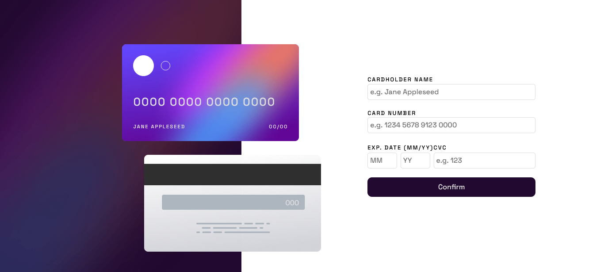
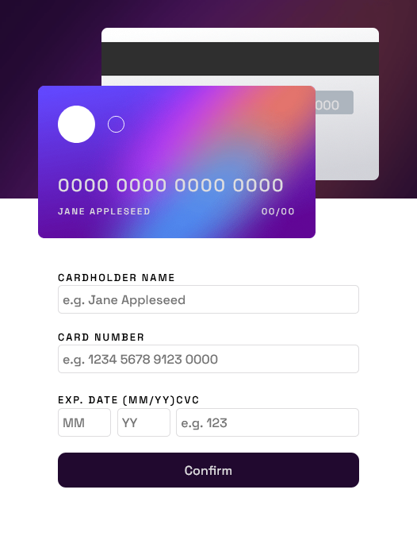

# Frontend Mentor - Interactive card details form solution

This is a solution to the [Interactive card details form challenge on Frontend Mentor](https://www.frontendmentor.io/challenges/interactive-card-details-form-XpS8cKZDWw). Frontend Mentor challenges help you improve your coding skills by building realistic projects. 

## Table of contents

- [Overview](#overview)
  - [The challenge](#the-challenge)
  - [Screenshot](#screenshot)
  - [Links](#links)
- [My process](#my-process)
  - [Built with](#built-with)
  - [What I learned](#what-i-learned)
  - [Continued development](#continued-development)
- [Author](#author)
- [Acknowledgments](#acknowledgments)

**Note: Delete this note and update the table of contents based on what sections you keep.**

## Overview

### The challenge

Users should be able to:

- Fill in the form and see the card details update in real-time
- Receive error messages when the form is submitted if:
  - Any input field is empty
  - The card number, expiry date, or CVC fields are in the wrong format
- View the optimal layout depending on their device's screen size
- See hover, active, and focus states for interactive elements on the page

### Screenshot

mobile

### Links

- Solution URL: [solution URL](https://github.com/Silkiercomet/interactvie-card-details)
- Live Site URL: [ live site URL ](https://silkiercomet.github.io/interactvie-card-details/)

## My process

### Built with

- Semantic HTML5 markup
- CSS custom properties
- Flexbox
- CSS Grid
- BEM naming convention
- CSS animations
- Javascript

### What I learned

A great practice for using position properties specifically for absolute value, in addition to using them to correctly position the content of the cards in the UI, it was also a great practice for managing the DOM.

### Continued development

It can definitely be improved, you should add all the elements of the form to the global scope and access their values ​​only when the submit event is activated, this way you will have a reference to the elements and you will not have to do a query every time that are required

You could also create a class for all the elements of the cards since most of the same events always occur

## Author

- Website - [Add your name here](https://www.your-site.com)
- Frontend Mentor - [@silkiercomet](https://www.frontendmentor.io/profile/yourusername)

## Acknowledgments

in the espace between the form inputs is better to use grid, it gives you better control over the workflow and is easy to get the required layout, with flex it was a nighmare to pull it our and after accomplished it has weird behaviors 

